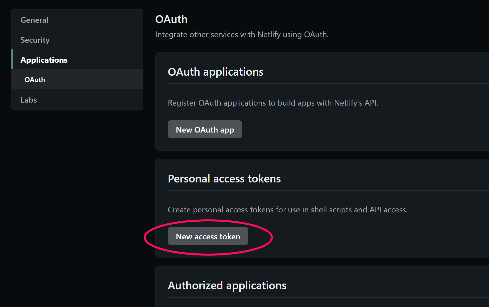
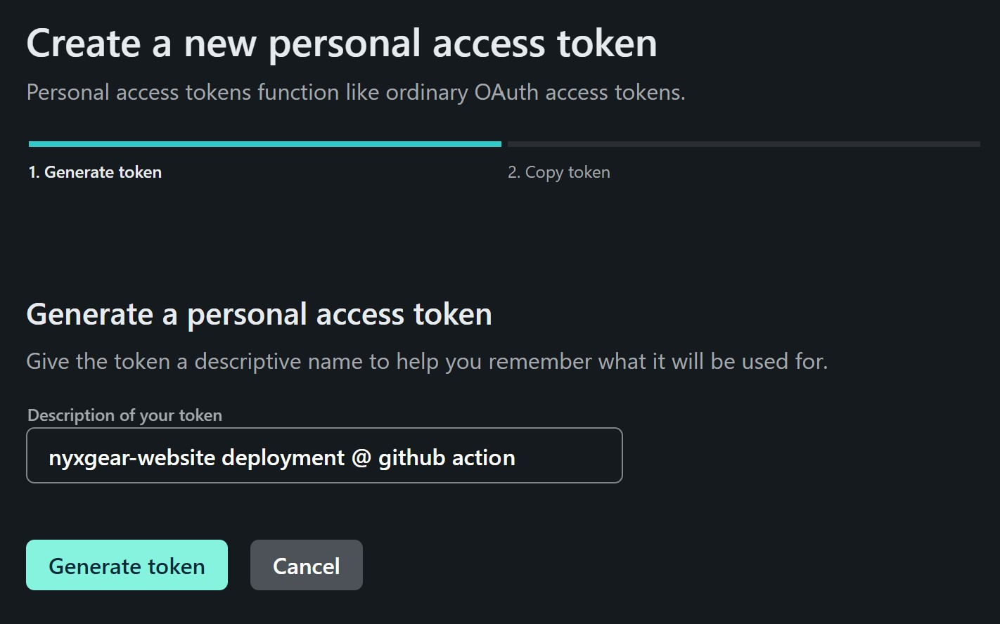
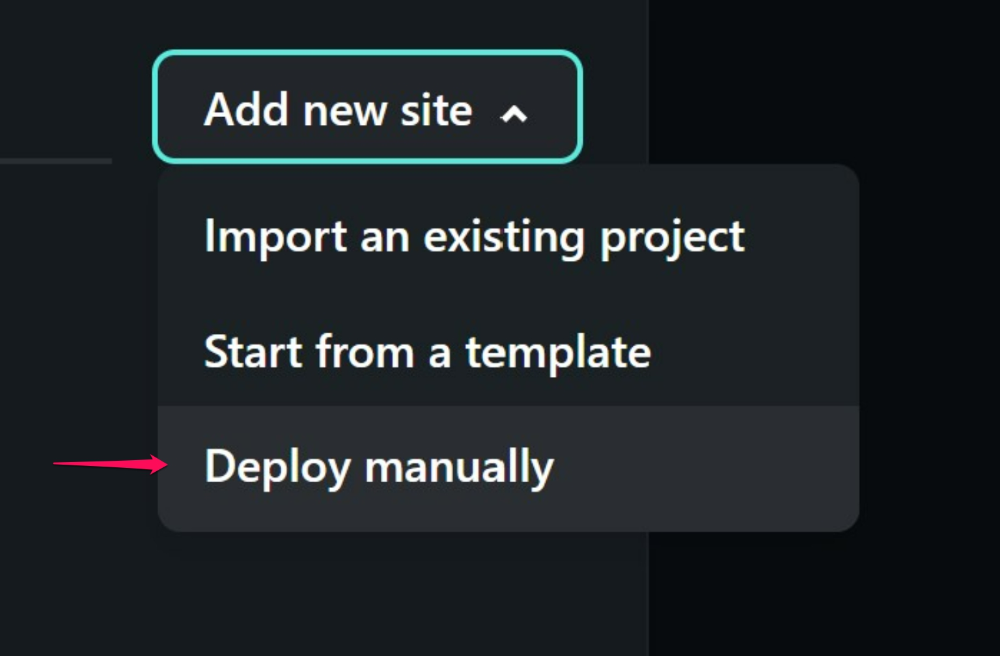
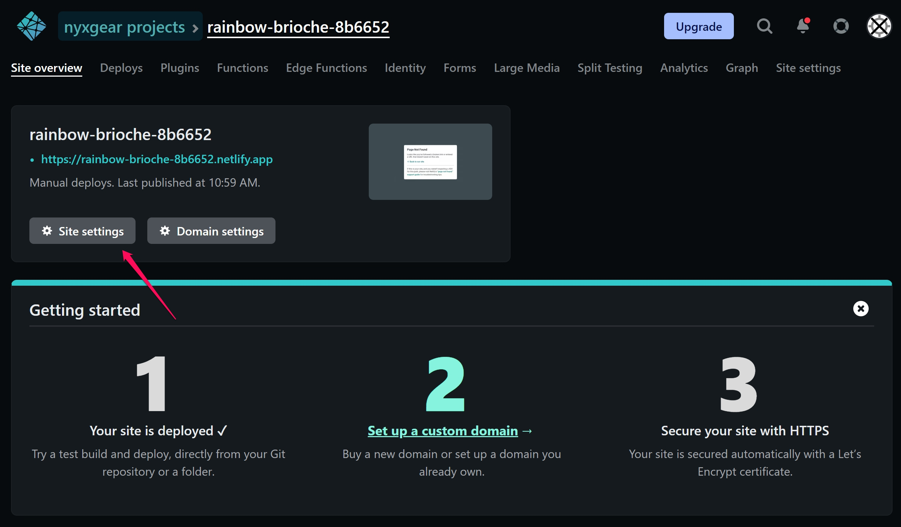
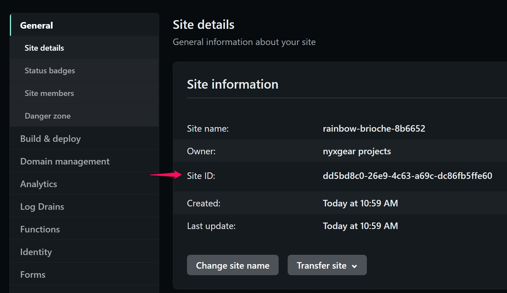
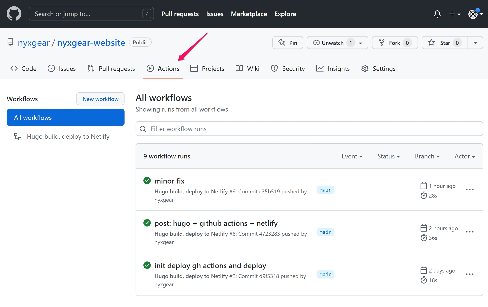

It's been a while since I'm thinking to create a blog using [Hugo](https://gohugo.io/), a powerful static site generator that allows converting a bunch of Markdown files into a nice static website.

I wanted to use Hugo because of its extensibility, large community, and simplicity in writing new posts with the approach [WYSIWYM](https://en.wikipedia.org/wiki/WYSIWYM). Then, to have a quick contents-update workflow, I set up continuous builds via a [GitHub Actions](https://github.com/features/actions) pipeline that, on its end, publishes the built website to [Netlify](https://www.netlify.com/) on each new commit.


**Why Netlify?**

At first, I published this website to an S3 bucket, set up the AWS Cloud Front service to deliver contents via a CDN and being able to point my custom domain to it It worked, it was a nice setup but it was more complicated and "costly" than Netlify. My concern was not exactly on the monthly costs (few cents) while instead on what would have happened if I forgot to update my credit card once expired (something that might happen since a few years from now!). Answer: AWS would shut down the services and the website would go offline. 

Instead, since Netlify does not require any credit card at all, I'm more comfortable that at least that scenario will never happen. Also, with Netlify I managed to achieve a simpler and more intuitive setup, on their great and reliable static hosting service.

## Create a Hugo Website

### Getting Started

Hugo [documentation](https://gohugo.io/documentation/) is a good place when you want to go deeper into the details but I found it a bit dispersive and poor for newcomers like me. Here in this article, I want to report my setup process and also explain the reasons for some choices done along the way.

But.. first thing first, we need to [install Hugo](https://gohugo.io/getting-started/installing/)! Native installations are a good way to go. However, I prefer to use Docker when possible. There exists a [docker-hugo](https://github.com/klakegg/docker-hugo) container that has Hugo installed and it's just ready to use.

### Initialization

To initialize the website:

```bash
docker run --rm -it \
  -u $(id -u):$(id -g) \
  -v $(pwd):/src \
  klakegg/hugo:0.93.2 new site <site-name> -f yml
```

The `-f yml` option at the end specifies to use the YML format for the Hugo *config* file (this is a suggestion from the theme).

Great! The website is ready but.. still without the theme.

### Installing the Theme

The [Hugo theme gallery](https://themes.gohugo.io/) offers a wide range of themes.

My suggestion is to choose the template *first*, look at its documentation, and just **then** initialize your website. Carefully read the theme installation procedure since it might differ a bit from the Hugo official documentation. Of course, for this reason, I had to initialize this website couple of times...

I decided to go with the [PaperMod](https://themes.gohugo.io/themes/hugo-papermod/) theme: a good-looking compromise between features, simplicity, support, and extendibility.

I've followed the [PaperMod installation doc](https://github.com/adityatelange/hugo-PaperMod/wiki/Installation) and from that, I've discovered there are multiple ways you can install a Hugo theme.

1. Manually download source code from GitHub, and place it into the project's themes folder.
2. Do a regular clone of the theme repo into the themes folder. 
3. Use git submodules to add the theme as a dependency of your project.

Method 1 is good for its simplicity, but it has a drawback. By manually downloading the theme code from Github to the theme folder of your repo, you end up saving all the theme code into your git repo. When you update the theme you have to manually re-download the new version, overwrite files into the theme folder, and again commit all the theme's changes to your repository. I don't find it very convenient and neither "clean", yet of course is very simple.

Method 2 is the one I recommend the least. You clone the theme `git clone https://github.com/<theme-project-url> themes/<theme> --depth=1` but then you are "in troubles" with your git repo. As soon as you will do a commit, git will complain giving a warning: "another git repository inside your current repository". That's a fair complaint and if you ignore it moving on with the commit then you'll store in your repo an "orphan submodule". To say it simply, git will save just an empty folder, without any content of your theme! It won't be so pleasant when doing a new clone of your project, you'll have to once again clone *manually* the theme. You'd then have to be sure to get the right theme version installed... "what was that the version you installed months/years ago?". Things are likely to mess up easily and quickly with this method.

I don't recommend using this method, although you can lead it to "Method 1" by deleting the `.git` folder *of the theme* (`rm -rf themes/<your-theme>/.git`) and then committing theme files to your repo.

Last and best of all is method 3, the one I used and that includes the theme repo as a [git submodule](https://www.atlassian.com/git/tutorials/git-submodule).

```bash
# enter the just-initialized folder
cd <site-name>
# init a git repository
git init .
# let's do an initial commit to keep things organized
git add . && git commit -m 'Initial commit'
# add the submodule to the repo
git submodule add --depth=1 https://github.com/<your-theme-url> themes/<your-theme>

git add . && git commit -m 'Add theme'
```

Via git submodules, the included git repository behaves exactly by what it is: a git repository! Inside of it, you can pull new theme updates by a simple pull or checkout the theme version you prefer. Using this method, git stores into your project just a gitlink object (placed at the path of the theme folder). It's like it was for method 2, but this time saving also all the information (`.gitmodules` file) needed to correctly do future clones by cloning submodules as well.

Just remember that, when you will clone your website repo, an extra option `--recurse-submodules` is need to also initialize and update the submodules:

```bash
git clone --recurse-submodules <your-project-url>

# that's equivalent to:

git clone <your-project-url>
cd <your-project>
git submodule update --init
```

### Theme configuration

Each theme has its own configuration options. It depends on the theme you choose and how you want to tweak its behavior. 

In [my config.yml file](https://github.com/nyxgear/nyxgear-website/blob/main/config.yml) you find the options for this website, that I put together using the [PaperMod documentation](https://github.com/adityatelange/hugo-PaperMod/wiki).


## GitHub Actions setup

From the [Hugo on Netlify](https://docs.netlify.com/integrations/frameworks/hugo/) documentation you'll discover that Netlify integrates very well both with Hugo and GitHub. It first connects to your GitHub account and after a few simple steps, everything works like magic. Netlify pulls your repo at certain intervals, checks for changes and, if any, it rebuilds the Hugo website to lastly publish it.

However, I wanted to make GitHub Actions build the website and push it to Netlify. A "push" approach carried out by GitHub, instead of a "pull" approach carried out by Netlify. 

Reasons? 

1. I didn't like the pull approach. It has waiting times after you do a git push to see changes online. 
2. I don't want to be so tight to a specific hosting service. Tomorrow I might change my mind, or Netlify will disappear and I want to be able to switch to another hosting easily.
3. I don't like the magic of Netlify doing everything on its own (Yes, that convenient and helpful magic!). Instead, I prefer to have more control and be able to finely configure what I want in the build and deployment procedure, something not so straightforward if you rely on the Netlify procedure.
4. I don't want Netlify to access my GitHub account. Nothing against Netlify in particular and it is not because I don't trust them but, again, I prefer a push approach by which GitHub comes to Netlify and publish the website. Let's say a "downstream flow direction".

To setup GitHub Actions, create the file `.github/workflows/hugo-netlify.yml` in your repo, with the content:




Now, we need to provide permissions to GitHub in accessing Netlify and push the Hugo website once built. But, before doing so, we need a Netlify website!

## Netlify

On Netlify, we need to do a couple of things:

- Generate an authorization token, to let GitHub Actions authenticate and push the code
- Create a Netlify website to host the Hugo build result

### Generate the Auth Token

1. From the avatar icon, top-right corner, go to "User Settings".
2. On the left sidebar, choose "Applications" and then "New Access Token".



4. Choose a name for the token and generate it. I suggest something similar to:



5. Keep aside the generated token, we will use it later. Watch out! This string is *equivalent to a password* and provides access to your Netlify account. Don't forget it around!


### Create a Netlify Website 

If you just signed up to Netlify, you need to create what they call a "team": a group to store your projects/websites.

Once you have created a team, inside that, choose the “Add new site” > “Deploy manually” option to create a new site.



The site creation page will ask you to upload a folder with a website. Upload a folder with some random content (it will be overwritten later).

Then, you should have landed to the "Site overview" page, let's go to "Site settings":



As we did before with the authorization token, note down the “Site ID”, we will use it in a while.




## Finishing Up and Testing

It remains to do:

- configure the auth token and site ID as GitHub secrets
- creation of the first article and its publication

### GitHub Secrets Configuration

Secrets allow the secure use of sensitive information (like passwords, access keys, or auth tokens) into GitHub pipelines while keeping them out of git repositories. It is a best practice to avoid storing secrets in git repos, since even if you delete them later, they'll still be part of the git history. In that case they would be easily exploitable. To their place, environment variables (under the form of secrets) are injected at pipeline runtime to pass the sensitive information where/when needed.

Let's create the secrets that will be used in the pipeline as the variables `NETLIFY_AUTH_TOKEN` and `NETLIFY_SITE_ID`. See their use at the lines 32 and 33 in the `.github/workflows/hugo-netlify.yml` file we created to configure [GitHub Actions]().


On the GitHub repository page go to "Settings" > "Secrets" > "Actions".


Then, via the "New Repository Secret" button create the 2 secrets we need:

1. Name: **NETLIFY_AUTH_TOKEN**.

   Value: the *authorization token we generated before on netlify*.
2. Name: **NETLIFY_SITE_ID**. 

   Value: *site ID*. 

Done! As soon as the pipeline will be triggered with a git push, it will access the secrets, and the stage "Deploy to Netlify" will be able to push the code the website we created.

### First Article Online

It's time to go online with the first article!

Create a new article:

```bash
docker run --rm -it \
  -u $(id -u):$(id -g) \
  -v $(pwd):/src \
  klakegg/hugo:0.93.2 new posts/first-post.md
```

and add your contents to the file `content/posts/firs-post.md`.

If you want to see a preview start the Hugo server:

```bash
docker run --rm -it \
  -u $(id -u):$(id -g) \
  -v $(pwd):/src \
  klakegg/hugo:0.93.2 server
```

and check the result at <http://localhost:1313/>.

Good! Let's publish it... but how?

If all the configurations we did till now are just correct, we need to commit and push! That's all! (Use branch `main` - need in pipeline rule)

The GitHub pipeline should start, build the website and deploy it Netlify. You can check the runs and logs from the "Actions" menu on GitHub:



On Netlify, from the "Site settings" page, you have the link at which the website is currently online. In my case it was: `https://rainbow-brioche-8b6652.netlify.app/`


Lastly, for the icing on cake, you can map your custom domain (like `mywebsite.com`) to the Netlify website URL ([documentation to setup custom domains](https://docs.netlify.com/domains-https/custom-domains/)) so as to let users access your website via your personalized domain.
